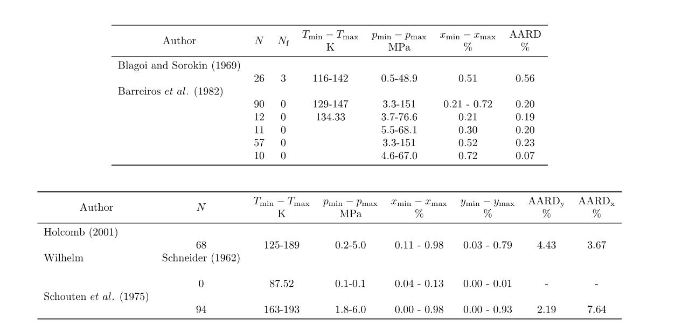

# thermostat
A toolbox for creating statistics for thermodynamic models.

All properties are calculated with https://github.com/usnistgov/teqp provided by Ian Bell.


# Build (cmake based)

To build the thermostat tool type in console in root of thermostat:

````
mkdir build
cd build
cmake .. -DTEQP_NO_PYTHON=ON -DTEQP_NO_TESTS=ON
cmake --build . --config Release.
````

(So far only tested on Windows using Visual C++ compiler)


# Usage

To use the toolbox you need to have your data in a special format. You can find an example for the binary mixture argon-krypton in the examples folder.
In the example/dev subdirectory are file for PVT and VLE data.

To run the program you need to provide a settings file with content following e.g.:

````
{"kind"         : "MieElong" ,
"model"       : {
"combination"   : "One-Fluid",
"components"    : ["argon","krypton"],
"dev_dir"       : "DEV",
"dev_files"     : ["ARKR_VLE.DEV","ARKR_PVT.DEV"],
"srk_path"      : "srk.json",
"model_path"    : "mie.json",
"BIP"           : "../externals/teqp/mycp/dev/mixtures/mixture_binary_pairs.json",
"departure"     : "../externals/teqp/mycp/dev/mixtures/mixture_departure_functions.json",
"coolprop_root" : "../externals/teqp/mycp",
"root"          : "../externals/teqp/mycp"}
}
````

To run the example type in console:

````
..\build\Release\THERMOSTAT.exe "settings.json"
python ..\python\table_tex.py DEV\stats.txt
````

This will produce a *tex file for each data file. You can use it in a tex document to get the final result.


